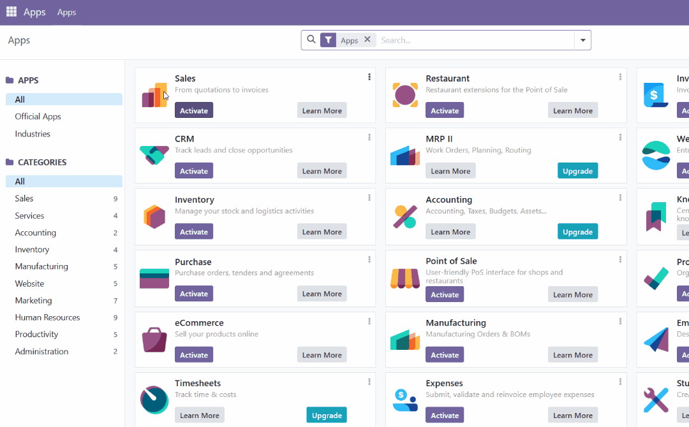
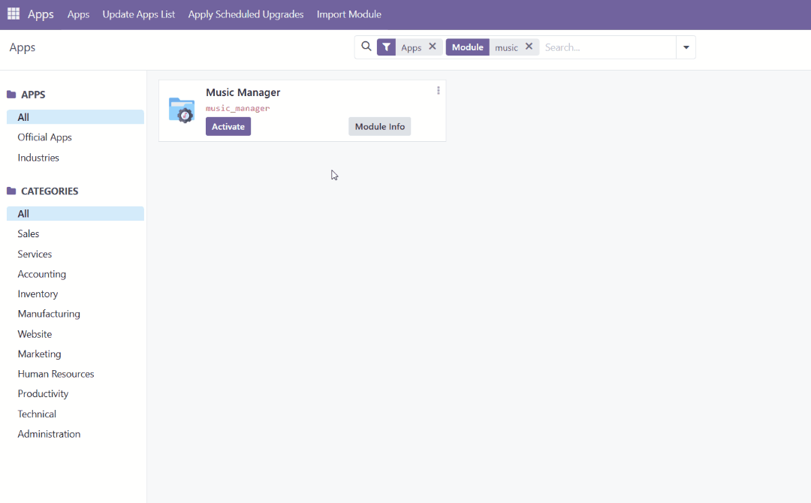

<a id="readme-top"></a>

# 🎸 Módulo para Odoo: Music Manager

Módulo personalizado para Odoo que permite **gestionar** y **organizar** tu colección musical según *artistas*, 
*álbumes*, *canciones* y *géneros*. <br/>
Este módulo guía al usuario paso a paso a completar los metadatos de la canción añadida (mediante la carga de un 
archivo o la descarga del mismo) y guarda el archivo final de forma ordenada en la carpeta principal `music`.

Puedes ver la lista de tareas aquí: <br/>
[](docs/TODO.md)

---

## 🎯 Objetivo

Mantener el directorio compartido con **Navidrome** (`music`) completamente organizado en carpetas (nombre del 
*artista*, nombre del *álbum*, número de pista y título de la canción) y los metadatos de la canción actualizados 
según los datos proporcionados por el usuario. De esta forma, **Navidrome** puede mostrar una biblioteca ordenada a 
sus clientes. <br/>
También permite que cada usuario tenga una biblioteca de música única (**Odoo**) pero una biblioteca musical 
compartida (**Navidrome**), siendo los usuarios quienes van ampliando la misma.

<p align="right"><a href="#readme-top">Volver ⏫</a></p>

---

## ⚙️ Instalación

Primero, asegúrate de tener **Python v.3.12.0** o superior, **Git v.2.45.2** o superior, **Docker v.28.4.0** o 
superior y **Odoo 17.0** instalados en tu sistema. <br/>
Puedes descargarlos desde los siguientes enlaces:

[](https://www.python.org/downloads/)
[](https://git-scm.com/downloads)
[](https://www.docker.com/)
[](https://www.odoo.com/documentation/17.0/developer/tutorials/setup_guide.html)

> [!NOTE]
> Para instalar el módulo desde el proyecto **NavidromeServer**, sigue los pasos a partir de la 
> [instalación del módulo](#-instalación-del-módulo).

### 🔹 Copia el módulo

En la carpeta `addons/` añade la carpeta del módulo en minúsculas y sustituyendo los espacios por guiones bajos 
(Music Manager → music_manager).

---

### 🔹 Reinicia Odoo

Utilizando la terminal reinicia el sistema con el siguiente comando:
```bash
./odoo-bin -c /etc/odoo/odoo.conf
```

Esto dentendrá todo proceso y volverá a levantar el servidor de **Odoo**.

---

### 🔹 Modo desarrollador

Habilita el modo desarrollador en la página principal de **Odoo** para poder actualizar las aplicaciones.

*Settings* > *Developer Tools* > *Activate the developer mode* > *Apps* > *Update Apps List*

Al realizar este paso, la aplicación debería aparecer en la lista de aplicaciones que se pueden instalar.



---

### 🔹 Instalación del módulo

Busca la aplicación *Music Manager* y pulsa el botón **Activar**.



Como este módulo crea dos grupos específicos de Usuario, deberás ir a *'Settings'*, y en *'Manage Users'* asignar los 
permisos a cada usuario.

#### Music Manager Admin

 * Permite la eliminación de canciones de la carpeta principal de **Navidrome**.
 * Agrupa las canciones según su propietario.

#### Music Manager User

 * Solo pueden eliminar registros de su base de datos, los archivos físicos se mantienen en la carpeta de **Navidrome**.

> [!IMPORTANT]
> Para poder ver el módulo activo, deberás asignar el grupo a tu usuario. ¡De lo contrario, **Music Manager** 
> no se mostrará! Una vez asignes los roles a los usuarios, tan solo necesitarás refrescar la página.

<p align="right"><a href="#readme-top">Volver ⏫</a></p>

---

## 🧩 Modelos

Los modelos se encargan de representar de forma digital los conceptos dados.

> [!NOTE]
> Puede que los atributos cambien a medida que se van desarrollando los mismos. Por ahora se mostrarán los 
> atributos más genéricos que se pueden encontrar.

En este modelo hemos creado los siguientes

### 👤 Artista

Representa al artista o grupo musical de la canción añadida.

 * Nombre del artista
 * Álbum
 * Descripción
 * Fotografía

### 💿 Álbum

Representa al álbum al que pertenece la canción.

 * Título del álbum
 * Artista
 * Número de disco
 * Año
 * Género
 * Canciones

### 🎵 Canción

Representa la canción en sí misma.

 * Título
 * Artista
 * Género
 * Álbum
 * Número de pista
 * Dirección donde se almacena el archivo

### 🗃️ Género

Representa el género de una canción o álbum

 * Nombre
 * Canción
 * Álbum

<p align="right"><a href="#readme-top">Volver ⏫</a></p>

---

## 🔗 Posibles integraciones futuras

 * Descarga automática de metadatos (por ejemplo, *MusicBrainz*)
 * Configuración de conversión de archivos
 * Soporte para múltiples lenguajes

---

## 📝 Licencia

Este módulo está protegido bajo la licencia **GNU LGPL v3.0**. <br/>
Puedes consultar el archivo [LICENSE](../../LICENSE.txt) para más información.

---

## 💬 Contacto

<div align="center">
    
</div>

¡Hola! ¡Mi nombre es Joan y este módulo es parte de mi segundo gran proyecto! Estoy estudiando programación desde 2023, 
habiendo empezado con Python. Estoy más que contento de poder compartir con todos vosotros mi progreso y mis ideas. 
Espero que disfrutes del proyecto tanto como yo disfruté al programarlo y si quieres darme feedback, por favor, siéntete 
libre de hacerlo porque es muy importante para mí. ¡Nos vemos en el siguiente proyecto! <br/>
¡Un abrazo! <br/>
<br/>
Joan <br/>
PD: ¡Te dejo enlaces de interés aquí abajo!

[](https://deepwiki.com/Ildiar25/NavidromeServer)
[](mailto:j.pastor1591@gmail.com)
[](https://www.linkedin.com/in/joan-pastor-vicens-aa5b4a55)
[](https://github.com/Ildiar25)

See you coding! 😜

<p align="right"><a href="#readme-top">Volver ⏫</a></p>